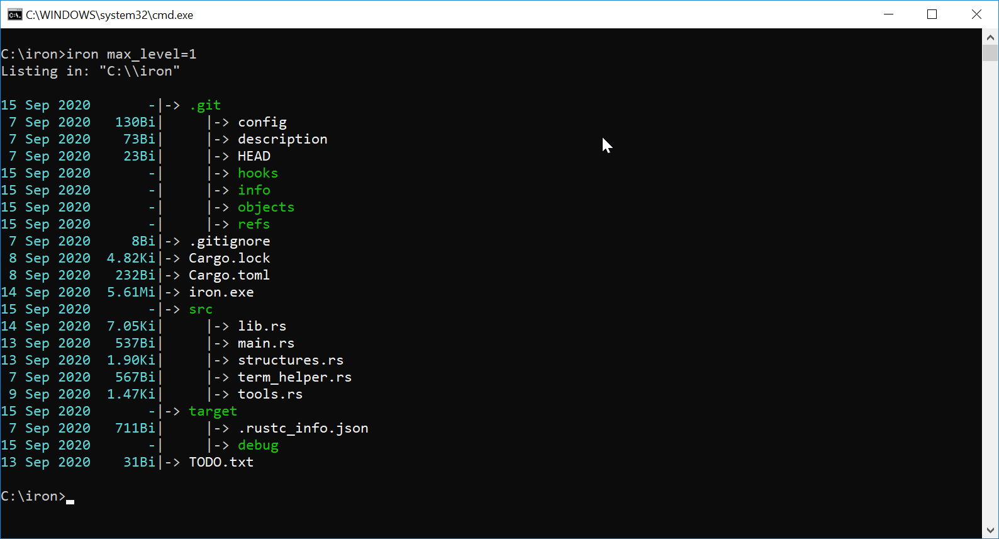

# iron
iron is intended to be a replacement of "dir" command-line utility, on Windows OS.

# Progress

iron is still under development. Some basic features/options though are already implemented such as grid and tree view. Your contributon is most welcomed.

# Screenshots

# Options

**Coming soon...**
